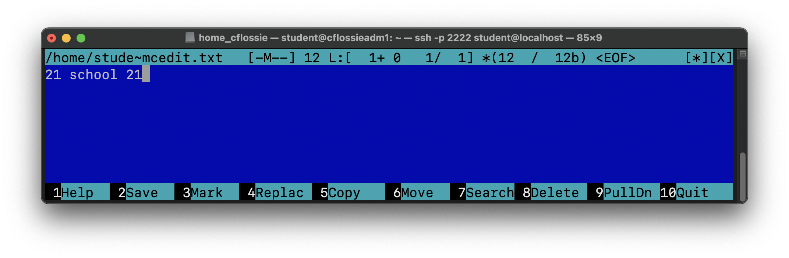

# D01_Linux-0 by Corrin Flossie

## Contents
1. [Part 1. Установка ОС](#part-1-установка-ос)
2. [Part 2. Создание пользователя](#part-2-создание-пользователя)
3. [Part 3. Настройка сети ОС](#part-3-настройка-сети-ос)
4. [Part 4. Обновление ОС](#part-4-обновление-ос)
5. [Part 5. Использование команды sudo](#part-5-использование-команды-sudo)
6. [Part 6. Установка и настройка службы времени](#part-6-установка-и-настройка-службы-времени)
7. [Part 7. Установка и использование текстовых редакторов](#part-7-установка-и-использование-текстовых-редакторов)
8. [Part 8. Установка и базовая настройка сервиса SSHD](#part-8-установка-и-базовая-настройка-сервиса-sshd)
9. [Part 9. Установка и использование утилит top, htop](#part-9-установка-и-использование-утилит-top-htop)
10. [Part 10. Использование утилиты fdisk](#part-10-использование-утилиты-fdisk)
11. [Part 11. Использование утилиты df](#part-11-использование-утилиты-df)
12. [Part 12. Использование утилиты du](#part-12-использование-утилиты-du)
13. [Part 13. Установка и использование утилиты ncdu](#part-13-установка-и-использование-утилиты-ncdu)
14. [Part 14. Работа с системными журналами](#part-14-работа-с-системными-журналами)
15. [Part 15. Использование планировщика заданий CRON](#part-15-использование-планировщика-заданий-cron)

## Part 1. Установка ОС

### == Задание == ### 
#### Установить Ubuntu 20.04 Server LTS без графического интерфейса. (Используем программу для виртуализации - VirtualBox) 

*
Рис. 1 Установить Ubuntu 20.04 Server LTS без графического интерфейса
*

***

## Part 2. Создание пользователя

### == Задание == ### 
#### Создать пользователя, отличного от пользователя, который создавался при установке. Пользователь должен иметь разрешение на прочтение логов из папки /var/log.

*
Рис. 2 Создание пользователя 
*

*
Рис. 3 Просмотр принадлежности к группе, которая может читать логи 
*

***

## Part 3. Настройка сети ОС

### == Задание == ### 
#### Задать название машины вида пользователь_1 (имя пользователя из Part 2)

*
Рис. 4 Комманда изменения названия машины 
*

*
Рис. 5 Имя машины до изменения 
*

*
Рис. 6 Имя машины после изменения 
*

---
### == Задание == ### 
#### Установить временную зону, соответствующую вашему текущему местоположению.

*
Рис. 7 Настройка времени системы 
*

---
### == Задание == ### 
#### Вывести названия сетевых интерфейсов с помощью консольной команды.

*
Рис. 8 Названия сетевых интерфейсов 
*

* В отчёте дать объяснение наличию интерфейса lo.

### *Устройство обратной связи (loopback, lo)*

Это специальный виртуальный сетевой интерфейс, который компьютер использует для связи с самим собой. Он используется в основном для диагностики и устранения неполадок, а также для подключения к серверам, работающим на локальной машине.

### *Цель петли*

Когда сетевой интерфейс отключен - например, когда порт Ethernet отключен или Wi-Fi отключен или не связан с точкой доступа - невозможна связь по этому интерфейсу, даже связь между компьютером c самим собой. Интерфейс обратной связи не представляет никакого реального оборудования, но существует, поэтому приложения, всегда могут подключаться к серверам на одном компьютере.

Это важно для устранения неполадок (это можно сравнить с просмотром в зеркале). Устройство обратной связи иногда объясняется как чисто диагностический инструмент. Но это также полезно, когда сервер, предлагающий нужный вам ресурс, работает на компьютере.

Например, если вы запускаете веб-сервер, у вас есть все веб-документы и вы можете просматривать их файл за файлом. Вы также можете загружать файлы в свой браузер, хотя с активным содержимым на стороне сервера он не будет работать так, как при обычном доступе к нему.

Поэтому, если вы хотите использовать тот же сайт, что и другие, лучше всего подключиться к вашему собственному серверу. Интерфейс обратной связи облегчает это.

---
### == Задание == ### 
#### Используя консольную команду получить ip адрес устройства, на котором вы работаете, от DHCP сервера.

*
Рис. 9 Получение ip адреса устройства 
*

* В отчёте дать расшифровку DHCP.

*DHCP (англ. Dynamic Host Configuration Protocol — протокол динамической настройки узла)* — прикладной протокол, позволяющий сетевым устройствам автоматически получать IP-адрес и другие параметры, необходимые для работы в сети TCP/IP. Данный протокол работает по модели «клиент-сервер». Для автоматической конфигурации компьютер-клиент на этапе конфигурации сетевого устройства обращается к так называемому серверу DHCP и получает от него нужные параметры. Сетевой администратор может задать диапазон адресов, распределяемых сервером среди компьютеров. Это позволяет избежать ручной настройки компьютеров сети и уменьшает количество ошибок. Протокол DHCP используется в большинстве сетей TCP/IP.

---
### == Задание == ### 
#### Определить и вывести на экран внешний ip-адрес шлюза (ip) и внутренний IP-адрес шлюза, он же ip-адрес по умолчанию (gw).

*
Рис. 10 Внешний и внутренний IP 
*

---
### == Задание == ### 
#### Задать статичные (заданные вручную, а не полученные от DHCP сервера) настройки ip, gw, dns (использовать публичный DNS серверы, например 1.1.1.1 или 8.8.8.8).

*
Рис. 11 Статически заданный IP 
*

*
Рис. 12 Пропинговка 
*

***

## Part 4. Обновление ОС

### == Задание == ### 
#### Обновить систему до последней на момент выполнения задания версии.

*
Рис. 13 Обновление системы
*

***

## Part 5. Использование команды sudo

### == Задание == ### 
#### Разрешить пользователю, созданному в Part 2, выполнять команду sudo.

*
Рис. 14 Sudo 
*

* В отчёте объяснить истинное назначение команды sudo (про то, что это слово - "волшебное", писать не стоит).

*sudo (англ. Substitute User and do, дословно «подменить пользователя и выполнить»)* — программа для системного администрирования UNIX-систем, позволяющая делегировать те или иные привилегированные ресурсы пользователям с ведением протокола работы. Основная идея — дать пользователям как можно меньше прав, при этом достаточных для решения поставленных задач. Программа поставляется для большинства UNIX и UNIX-подобных операционных систем.

---
* Поменять hostname ОС от имени пользователя, созданного в пункте Part 2. (используя sudo).

*
Рис. 15 Меняем hostname 
*

***

## Part 6. Установка и настройка службы времени

### == Задание == ### 
#### Настроить службу автоматической синхронизации времени.

* Вывести время, часового пояса, в котором вы сейчас находитесь.

*
Рис. 16 Время и часовой пояс 
*

* Вывод следующей команды должен содержать NTPSynchronized=yes: timedatectl status

*
Рис. 17 Время и часовой пояс 
*

***

## Part 7. Установка и использование текстовых редакторов

### == Задание == ### 
#### Установить текстовые редакторы VIM (+ любые два по желанию NANO, MCEDIT, JOE и т.д.)

*
Рис. 18 Установка текстовых редакторов 
*

---
### == Задание == ### 
#### Используя каждый из трех выбранных редакторов, создайте файл test_X.txt, где X -- название редактора, в котором создан файл. Напишите в нём свой никнейм, закройте файл с сохранением изменений.

*
Рис. 19 Создание файла для редактора VIM 
*

*
Рис. 20 Редактирование в VIM 
*

Для выхода и сохранения из редактора используем комбинацию клавиш «ESC», «'Shift' + ':'», «wq», «Enter».

*
Рис. 21 Создание файла для редактора 
*

*
Рис. 22 Редактирование в NANO
*

Для выхода и сохранения из редактора используем комбинацию клавиш «'Ctrl' + 'O'», «Enter» и «'Ctrl' + 'X'».

*
Рис. 23 Создание файла для редактора 
*

*
Рис. 24 Редактирование в MCEDIT
*

Для выхода и сохранения из редактора используем комбинацию клавиш «F2», «Enter», «F10».

---
### == Задание == ### 
#### Используя каждый из трех выбранных редакторов, откройте файл на редактирование, отредактируйте файл, заменив никнейм на строку "21 School 21", закройте файл без сохранения изменений.

*
Рис. 25 Редактирование в VIM 
*

Для выхода без сохранения из редактора VIM используем комбинацию клавиш «'Shift' + ':'», «q!» и «Enter».

*
Рис. 26 Редактирование в NANO
*

Для выхода без сохранения из редактора NANO используем комбинацию клавиш «'Ctrl' + 'X'» и «N».

*
Рис. 27 Редактирование в MCEDIT
*

Для выхода без сохранения из редактора MCEDIT используем комбинацию клавиш «F10», «<-» и «No».

---
### == Задание == ### 
#### Используя каждый из трех выбранных редакторов, отредактируйте файл ещё раз (по аналогии с предыдущим пунктом), а затем освойте функции поиска по содержимому файла (слово) и замены слова на любое другое.

*
Рис. 28-29 Поиск и замена в редакторе VIM
*

Порядок действий в редакторе VIM для поиска и замены слова:
Cтавим знак «:s/», пишем слово, которое хоим заменить, добавляем после слова, которое ищем еще один символ «/» и пишем слово, на которое хотим заменить

*
Рис. 30-32 Поиск и замена в редакторе NANO
*

Порядок действий в редакторе NANO для поиска и замены слова:
Нажимаем «'Ctrl' + '\'», вводим шаблон и затем «Enter», после чего вводим строку для замены, снова нажимаем «Enter» и подтверждаем замену, нажав клавишу «Y».

*
Рис. 33-35 Поиск и замена в редакторе NANO
*

Порядок действий в редакторе NANO для поиска и замены слова:
Нажимаем «F4» + «fn», вводим шаблон, затем нажимаем «Tab», после чего вводим строку для замены, далее «Enter», далее выбираем режим замены и подтверждаем нажатием «Enter».

***

## Part 8. Установка и базовая настройка сервиса SSHD

### == Задание == ### 
#### Установить службу SSHd.

*
Рис. 36 Установка SSH
*

___

#### Добавить автостарт службы при загрузке системы.

*
Рис. 37 Автостарт SSH при запуске системы
*

___
#### Перенастроить службу SSHd на порт 2022.

*
Рис. 38 Настройки службы SSHd
*

*
Рис. 39 Замена порта 20 на 2022
*

___
#### Используя команду ps, показать наличие процесса sshd. Для этого к команде нужно подобрать ключи.

*
Рис. 40 Замена порта 20 на 2022
*

PS - программа для просмотра списка процессов в Linux. Она не поддерживает интерактивный режим, зато имеет множество опций для настройки вывода тех или иных параметров процессов в Linux.

Обозначение ключей:
* -a - выбрать все процессы, кроме фоновых;
* -x - процессы, отсоединённые от терминала;
* -v -  отображает подробные данные о памяти процесса.

___
#### Перезагрузить систему.

*
Рис. 41 Перезагрузка системы
*

*
Рис. 42 Запуск команды netstat -tan
*

Обозначение ключей:
* -t - отображение текущего подключения в состоянии переноса нагрузки с процессора на сетевой адаптер при передаче данных ( "offload" ).
* -a - отображение всех подключений и ожидающих портов.
* -n - отображение адресов и номеров портов в числовом формате.

Обозначение столбцов:
* Proto — протокол соединения, используемый сокетом.
* Recv-Q — количество байтов, не скопированных программой пользователя, подключенной к этому сокету.
* Send-Q — количество байтов, не подтвержденных удаленным хостом.
* Local Address — адрес и номер порта локального конца сокета.
* Foreign Address — адрес и номер порта удаленного конца сокета.
* State — состояние сокета (состояние `LISTEN` - сокет прослушивает входящие соединения).

0.0.0.0. - подключение отсутствует

***

## Part 9. Установка и использование утилит top, htop

### == Задание == ### 
#### Установить и запустить утилиты top и htop.

*
Рис. 43 Установка top & htop
*
___
### == Задание == ### 
#### По выводу команды top определить и написать в отчёте:

*
Рис. 44 Вызов top
*

* uptime - 33 минуты
* количество авторизованных пользователей - 1 пользователь
* общую загрузку системы - 0,08 
* общее количество процессов - 122 процесса
* загрузку cpu - 0.0%
* загрузку памяти - 191.8 MiB
* pid процесса занимающего больше всего памяти - 1
* pid процесса, занимающего больше всего процессорного времени - 1

___
### == Задание == ### 
#### В отчёт вставить скрин с выводом команды htop:

* отсортированному по PID

*
Рис. 45 Сортировка по htop по PID
*

* отсортированному по PERCENT_CPU

*
Рис. 46 Сортировка по htop по PERCENT_CPU
*

* отсортированному по PERSENT_MEM

*
Рис. 47 Сортировка по htop по PERSENT_MEM
*

* отсортированному по TIME

*
Рис. 48 Сортировка по htop по TIME
*

* отфильтрованному для процесса sshd

*
Рис. 49 Сортировка по htop по sshd
*

* с процессом syslog, найденным, используя поиск

*
Рис. 50 Сортировка по htop по syslog
*

* с добавленным выводом hostname, clock и uptime

*
Рис. 51 Сортировка по htop пс добавленным выводом hostname, clock и uptime
*

***

## Part 10. Использование утилиты fdisk
### == Задание == ### 
#### Запустить команду fdisk -l.

*
Рис. 52 Запуск команды fdisk -l
*

Характеристики:
* название жесткого диска — VBOX HARDDISK.
* размер — 16 GiB.
* количество секторов — 33554432.

*
Рис. 53 Запуск команды swapon
*

* размер swap — 1.9G.

***

## Part 11. Использование утилиты df
### == Задание == ### 
#### Запустить команду df

*
Рис. 54 Запуск команды df
*

В отчёте написать для корневого раздела (/):
* размер раздела - 16445308Kib
* размер занятого пространства - 7249976KbKib
* размер свободного пространства - 8340244Kib
* процент использования - 47%

Определить и написать в отчёт единицу измерения в выводе
* Согласно man df умолчанию размер выводится в KiB.

___
#### Запустить команду df -Th.

*
Рис. 55 Запуск команды df -Th
*

Описание флагов:
* -T выводит информацию о файловой системе.
* -h печатает размер в человекочитаемом виде.

В отчёте написать для корневого раздела (/):
* размер раздела - 16G
* размер занятого пространства - 7.0G
* размер свободного пространства - 8.0G
* процент использования - 47%

Определить и написать в отчёт тип файловой системы для раздела.
* Используется файловая система ext4

***

## Part 12. Использование утилиты du

### == Задание == ### 
#### Запустить команду du

*
Рис. 56 Запуск команды df -Th
*

___
#### Вывести размер папок /home, /var, /var/log (в байтах, в человекочитаемом виде)

*
Рис. 57 Размер папки /home
*

*
Рис. 58 Запуск команды du -sh /var
*

*
Рис. 59 Запуск команды du -sh /var
*

___
#### Вывести размер всего содержимого в /var/log (не общее, а каждого вложенного элемента, используя *)

*
Рис. 60 Запуск команды du -ha /var. Часть 1 
*

*
Рис. 61 Запуск команды du -ha /var/log/. Часть 2
*

***

## Part 13. Установка и использование утилиты ncdu

### == Задание == ### 
#### Установить утилиту ncdu.

*
Рис. 62 Установка утилиты ncdu
*

___
#### Вывести размер папок /home, /var, /var/log.

*
Рис. 63 Запуск команды ncdu /home
*

*
Рис. 64 Запуск команды ncdu /var
*

*
Рис. 65 Запуск команды ncdu /var/log
*

***

## Part 14. Работа с системными журналами

### == Задание == ### 
#### Открыть для просмотра:
1. /var/log/dmesg
2. /var/log/syslog
3. /var/log/authlog

*
Рис. 66 Команды для просмотра логов
*

___
#### Написать в отчёте время последней успешной авторизации, имя пользователя и метод входа в систему.

*
Рис. 67 Последние вхождения в систему
*

* время успешной авторизации - Wed Dec 22 19:38  
* имя пользователя - student
* метод входа в систему - login

___
#### Перезапустить службу SSHd.

*
Рис. 68 Перезапуск службы SSHd
*
___
#### Вставить в отчёт скрин с сообщением о рестарте службы (искать в логах).

*
Рис. 69 Сообщение о рестарте службы
*

***

## Part 15. Использование планировщика заданий CRON

### == Задание == ### 
#### Используя планировщик заданий, запустите команду uptime через 2 минуты.

*
Рис. 70 Запуск планировщика заданий
*

*
Рис. 71 Настройка времени запуска команды uptime
*

* Найти в системных журналах строчки (минимум две в заданном временном диапазоне) о выполнении.

*
Рис. 72 Выполнение команды uptime
*

* Вывести на экран список текущих заданий для CRON.

*
Рис. 73 Cписок текущих заданий
*

___
#### Удалите все задания из планировщика заданий.

*
Рис. 74 Cписок заданий после удаления
*