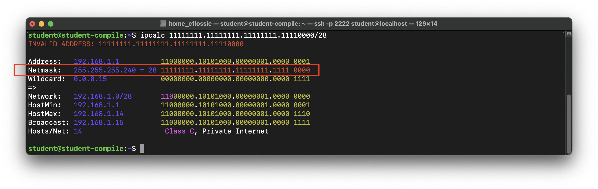
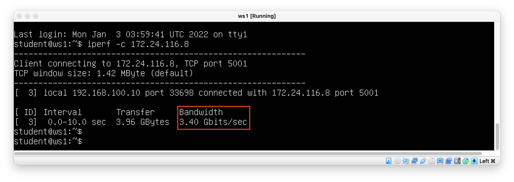
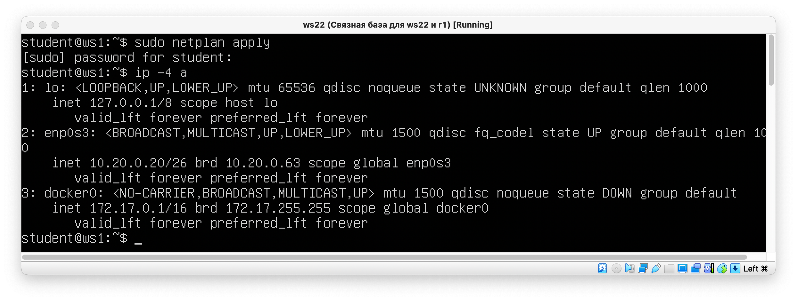
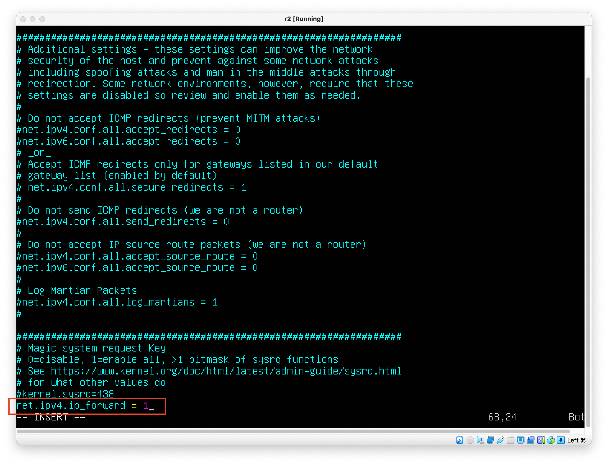
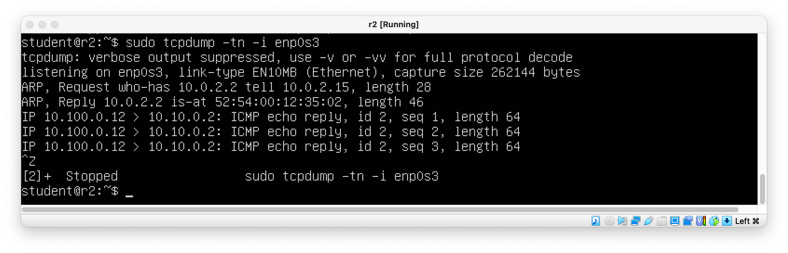
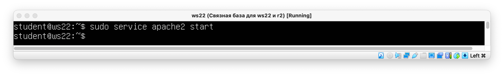
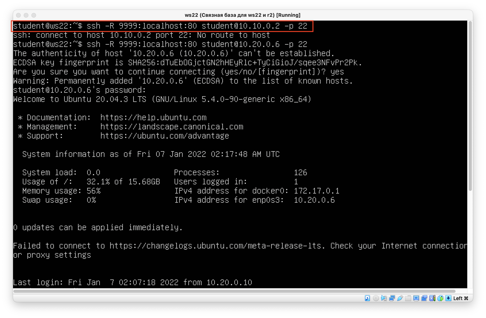

# DO2_LinuxNetwork-0 by Corrin Flossie

## Contents
  1. [Part 1. Инструмент ipcalc](#part-1-инструмент-ipcalc)
  2. [Part 2. Статическая маршрутизация между двумя машинами](#part-2-статическая-маршрутизация-между-двумя-машинами)
  3. [Part 3. Утилита iperf3](#part-3-утилита-iperf3)
  4. [Part 4. Сетевой экран](#part-4-сетевой-экран)
  5. [Part 5. Статическая маршрутизация сети](#part-5-статическая-маршрутизация-сети)
  6. [Part 6. Динамическая настройка IP с помощью DHCP](#part-6-динамическая-настройка-ip-с-помощью-dhcp)
  7. [Part 7. NAT](#part-7-nat)
  8. [Part 8. Дополнительно. Знакомство с SSH Tunnels](#part-8-дополнительно-знакомство-с-ssh-tunnels)


## Part 1. Инструмент ipcalc
### == Задание ==
#### Поднять виртуальную машину (далее -- ws1)

### 1.1. Сети и маски
#### Определить и записать в отчёт:
##### 1) Адрес сети 192.167.38.54/13


*<p align="center">Рис. 1 Адрес сети 192.167.38.54/13<p>*

###### 2)  Перевод маски 255.255.255.0 в префиксную и двоичную запись, /15 в обычную и двоичную, 11111111.11111111.11111111.11110000 в обычную и префиксную


*<p align="center">Рис. 2 Перевод маски 255.255.255.0 в префиксную и двоичную запись <p>*


*<p align="center">Рис. 3 Перевод маски 255.255.255.0 /15 в обычную и двоичную<p>*


*<p align="center">Рис. 4 Перевод 11111111.11111111.11111111.11110000 в обычную и префиксную<p>*

##### 3)  Минимальный и максимальный хост в сети 12.167.38.4 при масках; /8, 11111111.11111111.00000000.00000000, 255.255.254.0 и /4


*<p align="center">Рис. 5 Минимальный и максимальный хост в сети 12.167.38.4 при маске /8<p>*


*<p align="center">Рис. 6 Минимальный и максимальный хост в сети 12.167.38.4 при маске 11111111.11111111.00000000.00000000<p>*


*<p align="center">Рис. 7 Минимальный и максимальный хост в сети 12.167.38.4 при маске 255.255.254.0<p>*


*<p align="center">Рис. 8 Минимальный и максимальный хост в сети 12.167.38.4 при маске /4<p>*

### 1.2. localhost
##### Определить и записать в отчёт, можно ли обратиться к приложению, работающему на localhost, со следующими IP: 194.34.23.100/16, 127.0.0.2/24, 127.1.0.1/8, 128.0.0.1/8

localhost (так называемый, «местный» от англ. local, или «локальный хост», по смыслу — этот компьютер) — в компьютерных сетях, стандартное, официально зарезервированное доменное имя для частных IP-адресов (в диапазоне 127.0.0.1 — 127.255.255.254).

```
194.34.23.100/16 - нет
127.0.0.2/24 - да
127.1.0.1/8 - да
128.0.0.1/8 - нет
```

### 1.3. Диапазоны и сегменты сетей
#### Определить и записать в отчёт:
##### 1) Какие из перечисленных IP можно использовать в качестве публичного, а какие только в качестве частных: 10.0.0.45/8, 134.43.0.2/16, 192.168.4.2/16, 172.20.250.4/12, 172.0.2.1/12, 192.172.0.1/12, 172.68.0.2/12, 172.16.255.255/12, 10.10.10.10/8, 192.169.168.1/16

Все IP-адреса протокола IPv4 делятся на публичные/глобальные/внешние (их называют "белые") — они используются в сети Интернет, и частные/локальные/внутренние (их называют "серые") — используются в локальной сети.
В сети Интернет используются именно публичные глобальные адреса. Публичным IP-адресом называется IP-адрес, который используется для выхода в Интернет. Публичные (глобальные) IP-адреса маршрутизируются в Интернете, в отличие от частных адресов.

Частные внутренние адреса не маршрутизируются в Интернете и на них нельзя отправить трафик из Интернета, они работают только в пределах локальной сети.
К частным "серым" адресам относятся IP-адреса из следующих подсетей:

1. От 10.0.0.0 до 10.255.255.255 с маской 255.0.0.0 или /8
2. От 172.16.0.0 до 172.31.255.255 с маской 255.240.0.0 или /12
3. От 192.168.0.0 до 192.168.255.255 с маской 255.255.0.0 или /16
4. От 100.64.0.0 до 100.127.255.255 с маской подсети 255.192.0.0 или /10; данная подсеть рекомендована согласно rfc6598 для использования в качестве адресов для CGN (Carrier-Grade NAT)

```
10.0.0.45/8 - частный
134.43.0.2/16 - публичный
192.168.4.2/16 - частный
172.20.250.4/12 - частный
172.0.2.1/12 - публичный
192.172.0.1/12 - публичный
172.68.0.2/12 - публичный
172.16.255.255/12 - частный
10.10.10.10/8 - частный
192.169.168.1/16 - публичный
```

##### 2)  Какие из перечисленных IP адресов шлюза возможны у сети 10.10.0.0/18: 10.0.0.1, 10.10.0.2, 10.10.10.10, 10.10.100.1, 10.10.1.255


*<p align="center">Рис. 9 Диапазон возомжных IP адресов у сети 10.10.0.0/18<p>*

```
10.10.0.2
10.10.10.10
```

## Part 2. Статическая маршрутизация между двумя машинами
### == Задание ==
#### Поднять две виртуальные машины (далее -- ws1 и ws2)


*<p align="center">Рис. 10 Виртуальная машина ws2<p>*

#### С помощью команды ip a посмотреть существующие сетевые интерфейсы


*<p align="center">Рис. 11 Вызов команды ip a<p>*

#### Описать сетевой интерфейс, соответствующий внутренней сети, на обеих машинах и задать следующие адреса и маски: ws1 - 192.168.100.10, маска /16, ws2 - 172.24.116.8, маска /12


*<p align="center">Рис. 12 Настройки сетевого интерфейса<p>*

ws1


*<p align="center">Рис. 13 Настройки сетевого интерфейса - ws1<p>*


*<p align="center">Рис. 14  Команда netplan apply для перезапуска сервиса сети<p>*

ws2


*<p align="center">Рис. 15  Настройки сетевого интерфейса - ws2; Команда netplan apply для перезапуска сервиса сети<p>*


### 2.1. Добавление статического маршрута вручную
#### Добавить статический маршрут от одной машины до другой и обратно при помощи команды вида ip r add
##### Пропинговать соединение между машинами


*<p align="center">Рис. 16  Добавление статического маршрута и пинг для машины ws1<p>*


*<p align="center">Рис. 17  Добавление статического маршрута и пинг для машины ws2<p>*

### 2.1. Добавление статического маршрута с сохранением
#### Перезапустить машины
#### Добавить статический маршрут от одной машины до другой с помощью файла etc/netplan/00-installer-config.yaml


*<p align="center">Рис. 18  Вызов команды для изменения настроет статического маршрута для машины ws1<p>*


*<p align="center">Рис. 19  Прописываем маршрут до другой машины для ws1<p>*


*<p align="center">Рис. 20  Пингуем<p>*

Повторяем процесс для машины ws2


*<p align="center">Рис. 21  Вызов команды для изменения настроет статического маршрута для машины ws2<p>*


*<p align="center">Рис. 22  Прописываем маршрут до другой машины для ws1<p>*


*<p align="center">Рис. 23  Пингуем<p>*

## Part 3. Утилита iperf3
### == Задание ==
#### 3.1. Скорость соединения
##### Перевести и записать в отчёт: 8 Mbps в MB/s, 100 MB/s в Kbps, 1 Gbps в Mbps

```
8 Mbps - 1 MB/s
100 MB/s - 819200 Kbps
1 Gbps - 1024 Mbps
```

#### 3.1. Утилита iperf3
##### Измерить скорость соединения между ws1 и ws2

```
Вызываем утилиту iperf -s (в режиме сервера) на виртуальной машине  ws2
```


*<p align="center">Рис. 24  Вызываем утилиту iperf -s<p>*

```
Вызываем утилиту iperf -c 172.24.116.8 (в режиме клиента) на виртуальной машине  ws1
```


*<p align="center">Рис. 25  Вызываем утилиту iperf -c 172.24.116.8<p>*

## Part 4. Сетевой экран
### == Задание ==
#### 4.1. Утилита iptables
##### Создать файл /etc/firewall.sh, имитирующий фаерволл, на ws1 и ws2:

Создать файл /etc/firewall.sh, имитирующий фаерволл, на ws1 и ws2:


*<p align="center">Рис. 26  Создаем файл firewall.sh на ws1<p>*


*<p align="center">Рис. 27  Создаем файл firewall.sh на ws2<p>*

```
#!/bin/sh

# Удаление всех правил в таблице "filter" (по-умолчанию).
iptables –F
iptables -X
```
Нужно добавить в файл подряд следующие правила:
1) на ws1 применить стратегию когда в начале пишется запрещающее правило, а в конце пишется разрешающее правило (это касается пунктов 4 и 5)
2) на ws2 применить стратегию когда в начале пишется разрешающее правило, а в конце пишется запрещающее правило (это касается пунктов 4 и 5)
3) открыть на машинах доступ для порта 22 (ssh) и порта 80 (http)
4) запретить echo reply (машина не должна "пинговаться”)
5) разрешить echo reply (машина должна "пинговаться")


*<p align="center">Рис. 28  Скрипт firewall.sh на ws1<p>*


*<p align="center">Рис. 29  Скрипт firewall.sh на ws2<p>*

##### Запустить файлы на обеих машинах командами chmod +x /etc/firewall.sh и /etc/firewall.sh


*<p align="center">Рис. 30  Запуск скрипта firewall.sh на ws1<p>*


*<p align="center">Рис. 31  Запуск скрипта firewall.sh на ws2<p>*

Разница в стратегиях в том, что на ws1 указывется правило, которое сначало блокирует, а второе - разрешает пинг. Из-за того, что при каждом правиле добавляется флаг -A, ws1 блокирует echo reply, потому что у запрещающего правила выше приоритет.

#### 4.1. Утилита nmap
##### Командой ping найти машину, которая не "пингуется", после чего утилитой nmap показать, что хост машины запущен
```
Проверка: в выводе nmap должно быть сказано: Host is up
```

*<p align="center">Рис. 32  Запуск ping 192.168.100.10 и запуск nmap<p>*

##### Сохранить дампы образов виртуальных машин


*<p align="center">Рис. 33  Выбираем машину<p>*

*<p align="center">Рис. 34  Указываем параметры<p>*

*<p align="center">Рис. 35  Сохраняем дамп машины<p>*


## Part 5. Статическая маршрутизация сети
### == Задание ==
#### Поднять пять виртуальных машин (3 рабочие станции (ws11, ws21, ws22) и 2 роутера (r1, r2))

#### 5.1. Настройка адресов машин
#### Настроить конфигурации машин в etc/netplan/00-installer-config.yaml согласно сети на рисунке.
* В отчёт поместить скрины с содержанием файла etc/netplan/00-installer-config.yaml для каждой машины.


*<p align="center">Рис. 36  Настройка конфигурации машины ws11<p>*


*<p align="center">Рис. 37  Настройка конфигурации машины ws21<p>*


*<p align="center">Рис. 38  Настройка конфигурации машины ws22<p>*


*<p align="center">Рис. 39  Настройка конфигурации машины r1<p>*


*<p align="center">Рис. 40  Настройка конфигурации машины r2<p>*

#### Перезапустить сервис сети. Если ошибок нет, то командой ip -4 a проверить, что адрес машины задан верно. Также пропинговать ws22 с ws21. Аналогично пропинговать r1 с ws11.

```
sudo netplan apply
```

*<p align="center">Рис. 41  Проверяем командой ip -4 a машину ws11<p>*


*<p align="center">Рис. 42  Проверяем командой ip -4 a машину ws21<p>*


*<p align="center">Рис. 43  Проверяем командой ip -4 a машину ws22<p>*


*<p align="center">Рис. 44  Проверяем командой ip -4 a машину r1<p>*


*<p align="center">Рис. 45  Проверяем командой ip -4 a машину r2<p>*


*<p align="center">Рис. 46  Пингуем ws22 с ws21<p>*


*<p align="center">Рис. 47  Пингуем r1 с ws11<p>*

#### 5.2. Включение переадресации IP-адресов.
#### Для включения переадресации IP, выполните команду на роутерах:
```
sysctl -w net.ipv4.ip_forward=1
```

*<p align="center">Рис. 48  Выполняем команду sysctl -w net.ipv4.ip_forward=1 на r1<p>*


*<p align="center">Рис. 49  Выполняем команду sysctl -w net.ipv4.ip_forward=1 на r2<p>*


*<p align="center">Рис. 50  Выполняем команду sysctl -w net.ipv4.ip_forward=1 на r2<p>*

#### Откройте файл /etc/sysctl.conf и добавьте в него следующую строку:
```
net.ipv4.ip_forward = 1
```

*<p align="center">Рис. 51  sysctl.conf на r1<p>*


*<p align="center">Рис. 52  sysctl.conf на r2<p>*

#### 5.3. Установка маршрута по-умолчанию
#### Настроить маршрут по-умолчанию (шлюз) для рабочих станций. Для этого добавить gateway4 [ip роутера] в файле конфигураций


*<p align="center">Рис. 53  Конфигурация ws11<p>*


*<p align="center">Рис. 54  Конфигурация ws22<p>*


*<p align="center">Рис. 55  Конфигурация ws21<p>*

#### Вызвать ip r и показать, что добавился маршрут в таблицу маршрутизации


*<p align="center">Рис. 56  Вызов команды ip r на машине ws11<p>*


*<p align="center">Рис. 57  Вызов команды ip r на машине ws21<p>*


*<p align="center">Рис. 58  Вызов команды ip r на машине ws22<p>*

#### Пропинговать с ws11 роутер r2 и показать на r2, что пинг доходит. Для этого использовать команду:
```
tcpdump -tn -i eth1
```

*<p align="center">Рис. 59  Пингуем r2 c машины  ws11<p>*


*<p align="center">Рис. 60  Выполняем команду tcpdump -tn -i eth1 на машине r2<p>*

#### 5.4. Добавление статических маршрутов
#### Добавить в роутеры r1 и r2 статические маршруты в файле конфигураций. Пример для r1 маршрута в сетку 10.20.0.0/26:
```
# Добавить в конец описания сетевого интерфейса eth1:
- to: 10.20.0.0
  via: 10.100.0.12
```
* В отчёт поместить скрины с содержанием изменённого файла etc/netplan/00-installer-config.yaml для каждого роутера.


*<p align="center">Рис. 61  00-installer-config.yaml на машине r1<p>*


*<p align="center">Рис. 62  00-installer-config.yaml на машине r2<p>*

#### Вызвать ip r и показать таблицы с маршрутами на обоих роутерах.:
* В отчёт поместить скрин с вызовом и выводом использованной команды.


*<p align="center">Рис. 63  Вызываем ip r на машине r1<p>*


*<p align="center">Рис. 64  Вызываем ip r на машине r2<p>*

#### Запустить команды на ws11:
```
ip r list 10.10.0.0/[маска сети] и ip r list 0.0.0.0/0
```

*<p align="center">Рис. 65  Вызываем ip r на машине ws11<p>*

* В отчёте объяснить, почему для адреса 10.10.0.0/[порт сети] был выбран маршрут, отличный от 0.0.0.0/0, хотя он попадает под маршрут по-умолчанию.
```
для адресов этой сети задано правило, приоритет которого выше, чем у default.
```

#### 5.5. Построение списка маршрутизаторов
#### Запустить на r1 команду дампа:
```
tcpdump -tnv -i eth0
```
* В отчёт поместить скрины с вызовом и выводом использованных команд (tcpdump и traceroute).


*<p align="center">Рис. 66  Вызываем команду sudo tcpdump -tnv -i enp0s8 на машине r1<p>*


*<p align="center">Рис. 67  Вызываем команду traceroute 10.20.0.10 на машине ws11<p>*

* В отчёте, опираясь на вывод, полученный из дампа на r1, объяснить принцип работы построения пути при помощи traceroute.

Traceroute — это служебная компьютерная программа, предназначенная для определения маршрутов следования данных в сетях TCP/IP. Traceroute может использовать разные протоколы передачи данных в зависимости от операционной системы устройства.  Операционные системы Linux и маршрутизаторы Cisco используют протокол UDP.

Для определения промежуточных маршрутизаторов traceroute отправляет целевому узлу серию UPD-пакетов (по умолчанию 3 пакета), с каждым шагом увеличивая значение поля TTL («время жизни») на 1. Это поле обычно указывает максимальное количество маршрутизаторов, которое может быть пройдено пакетом. Первая серия пакетов отправляется с TTL, равным 1, и поэтому первый же маршрутизатор возвращает обратно UDP-сообщение «time exceeded in transit», указывающее на невозможность доставки данных. Traceroute фиксирует адрес маршрутизатора, а также время между отправкой пакета и получением ответа (эти сведения выводятся на монитор компьютера). Затем traceroute повторяет отправку серии пакетов, но уже с TTL, равным 2, что заставляет первый маршрутизатор уменьшить TTL пакетов на единицу и направить их ко второму маршрутизатору. Второй маршрутизатор, получив пакеты с TTL=1, так же возвращает «time exceeded in transit».

Процесс повторяется до тех пор, пока пакет не достигнет целевого узла. При получении ответа от этого узла процесс трассировки считается завершённым.


#### 5.6. Использование протокола ICMP при маршрутизации
#### Запустить на r1 перехват сетевого трафика, проходящего через eth0 с помощью команды:
```
tcpdump -n -i eth0 icmp
```
#### Пропинговать с ws11 несуществующий IP (например, 10.30.0.111) с помощью команды:
```
ping -c 1 10.30.0.111
```
* В отчёт поместить скрин с вызовом и выводом использованных команд.


*<p align="center">Рис. 68  Вызываем команду ping -c 1 10.30.0.111 на машине ws11<p>*


*<p align="center">Рис. 69  Вызываем команду tcpdump -n -i eth0 icmp на машине r1<p>*

## Part 6. Динамическая настройка IP с помощью DHCP
### == Задание ==
#### Указать MAC адрес у ws11, для этого в etc/netplan/00-installer-config.yaml надо добавить строки: macaddress: 10:10:10:10:10:BA, dhcp4: true
* В отчёт поместить скрин с содержанием изменённого файла etc/netplan/00-installer-config.yaml.


*<p align="center">Рис. 70  Меняем конфигурацию на машине ws11<p>*

#### Для r2 настроить в файле /etc/dhcp/dhcpd.conf конфигурацию службы DHCP:
#### 1) указать адрес маршрутизатора по-умолчанию, DNS-сервер и адрес внутренней сети:


*<p align="center">Рис. 71  Указываем адрес маршрутизатора по-умолчанию, DNS-сервер и адрес внутренней сети для машины r2<p>*

#### 2) в файле resolv.conf прописать nameserver 8.8.8.8.
* В отчёт поместить скрины с содержанием изменённых файлов.


*<p align="center">Рис. 72  Вводим команду sudo vim /etc/resolv.conf и прописываем nameserver 8.8.8.8<p>*

#### Перезагрузить службу DHCP командой systemctl restart isc-dhcp-server. Машину ws21 перезагрузить при помощи reboot и через ip a показать, что она получила адрес. Также пропинговать ws22 с ws21.
* В отчёт поместить скрины с вызовом и выводом использованных команд.


*<p align="center">Рис. 73  Вызываем команду systemctl restart isc-dhcp-server на машине r2<p>*


*<p align="center">Рис. 74  Вызываем команду ip a на машине ws21<p>*


*<p align="center">Рис. 75  Делаем пинг между ws22 и ws21<p>*

#### Для r1 настроить аналогично, но сделать выдачу адресов с жесткой привязкой к MAC-адресу (ws11). Провести аналогичные тесты
* В отчёте этот пункт описать аналогично настройке для r2.


*<p align="center">Рис. 76  Указываем адрес маршрутизатора по-умолчанию, DNS-сервер и адрес внутренней сети для машины r1<p>*


*<p align="center">Рис. 77  Вводим команду sudo vim /etc/resolv.conf и прописываем nameserver 8.8.8.8<p>*


*<p align="center">Рис. 78  Вызываем команду systemctl restart isc-dhcp-server на машине r1<p>*


*<p align="center">Рис. 79  Вызываем команду ip a на машине ws21<p>*


*<p align="center">Рис. 80  Делаем пинг между r1 и ws11<p>*

#### Запросить с ws21 обновление ip адреса
* В отчёте поместить скрины ip до и после обновления.
* В отчёте описать, какими опциями DHCP сервера пользовались в данном пункте.


*<p align="center">Рис. 81  Вызываем команду ip a до освобождения<p>*


*<p align="center">Рис. 82  Вызываем команду ip a после освобождения<p>*

Для освобождения ip использовалась команда:
```
sudo dhclient -r
```

Для запроса нового ip использовалась команда:
```
sudo dhclient
```
## Part 7. NAT
### == Задание ==
#### В файле /etc/apache2/ports.conf на ws22 и r2 изменить строку Listen 80 на Listen 0.0.0.0:80, то есть сделать сервер Apache2 общедоступным
* В отчёт поместить скрин с содержанием изменённого файла.


*<p align="center">Рис. 83  Конфигурация портов на r2<p>*


*<p align="center">Рис. 84  Конфигурация портов на ws22<p>*

#### Запустить веб-сервер Apache командой service apache2 start на ws22 и r1
* В отчёт поместить скрины с вызовом и выводом использованной команды.


*<p align="center">Рис. 85  Запуск apache2 на ws22<p>*


*<p align="center">Рис. 86  Запуск apache2 на r1<p>*

#### Добавить в фаервол, созданный по аналогии с фаерволом из Части 4, на r2 следующие правила:
1) Удаление правил в таблице filter - iptables -F
2) Удаление правил в таблице "NAT" - iptables -F -t nat
3) Отбрасывать все маршрутизируемые пакеты - iptables --policy FORWARD DROP


*<p align="center">Рис. 87  Редактируем firewall.sh на r2<p>*

#### Запускать файл также, как в Части 4


*<p align="center">Рис. 88  Запуск firewall.sh на r2<p>*

#### Проверить соединение между ws22 и r1 командой ping
#### При запуске файла с этими правилами, ws22 не должна "пинговаться" с r1

* В отчёт поместить скрины с вызовом и выводом использованной команды.


*<p align="center">Рис. 89 Пинг между ws22 и r1<p>*

#### Добавить в файл ещё одно правило:
4) Разрешить маршрутизацию всех пакетов протокола ICMP
#### Запускать файл также, как в Части 4
#### Проверить соединение между ws22 и r1 командой ping
#### При запуске файла с этими правилами, ws22 должна "пинговаться" с r1
* В отчёт поместить скрины с вызовом и выводом использованной команды.


*<p align="center">Рис. 90  Редактируем firewall.sh на r2<p>*


*<p align="center">Рис. 91 Пинг между ws22 и r1<p>*


#### Добавить в файл ещё два правила:

5) Включить SNAT, а именно маскирование всех локальных ip из локальной сети, находящейся за r2 (по обозначениям из Части 5 - сеть 10.20.0.0)
Совет: стоит подумать о маршрутизации внутренних пакетов, а также внешних пакетов с установленным соединением

6) Включить DNAT на 8080 порт машины r2 и добавить к веб-серверу Apache, запущенному на ws22, доступ извне сети
Совет: стоит учесть, что при попытке подключения возникнет новое tcp-соединение, предназначенное ws22 и 80 порту

* В отчёт поместить скрин с содержанием изменённого файла.

*<p align="center">Рис. 92 Пинг между ws22 и r2<p>*

#### Запускать файл также, как в Части 4
Перед тестированием рекомендуется отключить сетевой интерфейс NAT (его наличие можно проверить командой ip a) в VirtualBox, если он включен

#### Проверить соединение по TCP для SNAT, для этого с ws22 подключиться к серверу Apache на r1 командой:
```
telnet [адрес] [порт]
```

*<p align="center">Рис. 93 Подключаемся к серверу Apache на ws22<p>*

#### Проверить соединение по TCP для DNAT, для этого с r1 подключиться к серверу Apache на ws22 командой telnet (обращаться по адресу r2 и порту 8080)
* В отчёт поместить скрины с вызовом и выводом использованных команд.


*<p align="center">Рис. 94 Подключаемся к серверу Apache на r1<p>*

## Part 8. Дополнительно. Знакомство с SSH Tunnels
### == Задание ==
#### Запустить веб-сервер Apache на ws22 только на localhost (то есть не изменять файл /etc/apache2/ports.conf или, если был изменен ранее, вернуть строку Listen 80)


*<p align="center">Рис. 95 Меняем обратно конфигурацию Apache на ws22<p>*


*<p align="center">Рис. 96 Запускаем Apache на ws22<p>*

#### Воспользоваться Local TCP forwarding с ws21 до ws22, чтобы получить доступ к веб-серверу на ws22 с ws21


*<p align="center">Рис. 97 Local TCP forwarding на ws21<p>*

#### Воспользоваться Remote TCP forwarding c ws11 до ws22, чтобы получить доступ к веб-серверу на ws22 с ws11


*<p align="center">Рис. 98 Remote TCP forwarding на ws21<p>*

#### Для проверки, сработало ли подключение в обоих предыдущих пунктах, перейдите во второй терминал (например, клавишами Alt + F2) и выполните команду:
```
telnet 127.0.0.1 [локальный порт]
```

*<p align="center">Рис. 99 Проверка соединения<p>*

* В отчёте описать команды, необходимые для выполнения этих четырёх пунктов, а также приложить скриншоты с их вызовом и выводом.