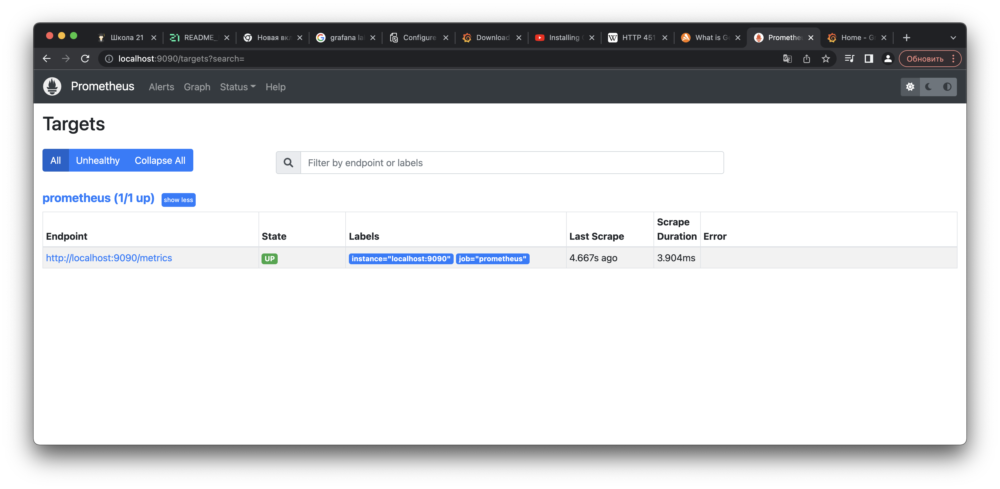

## Part 7. **Prometheus** и **Grafana**

**== Задание ==**

##### Установить и настроить **Prometheus** и **Grafana** на виртуальную машину

Для запуска и проверки состояния запустим следующие команды:
###### sudo systemctl start grafana-server
###### sudo systemctl status grafana-server
###### sudo systemctl start prometheus
###### sudo systemctl status prometheus

##### Получить доступ к веб интерфейсам **Prometheus** и **Grafana** с локальной машины

##### Добавить на дашборд **Grafana** отображение ЦПУ, доступной оперативной памяти, свободное место и кол-во операций ввода/вывода на жестком диске

##### Кодовое представление дашбордов

CPU: rate(node_cpu_seconds_total{job="node", instance="localhost:9100", mode!="idle"}[$__rate_interval])

Free RAM: node_memory_MemAvailable_bytes / 1024 / 1024

Free Space: node_filesystem_avail_bytes{mountpoint="/"} /1024/1024/1024

I\O disk: rate(node_disk_reads_completed_total{job="node", device="sda"}[$__rate_interval])

rate(node_disk_writes_completed_total{job="node", device="sda"}[$__rate_interval])

##### Запустить ваш bash-скрипт из [Части 2](#part-2-засорение-файловой-системы)
##### Посмотреть на нагрузку жесткого диска (место на диске и операции чтения/записи)

##### Установить утилиту **stress** и запустить команду `stress -c 2 -i 1 -m 1 --vm-bytes 32M -t 10s`
##### Посмотреть на нагрузку жесткого диска, оперативной памяти и ЦПУ

