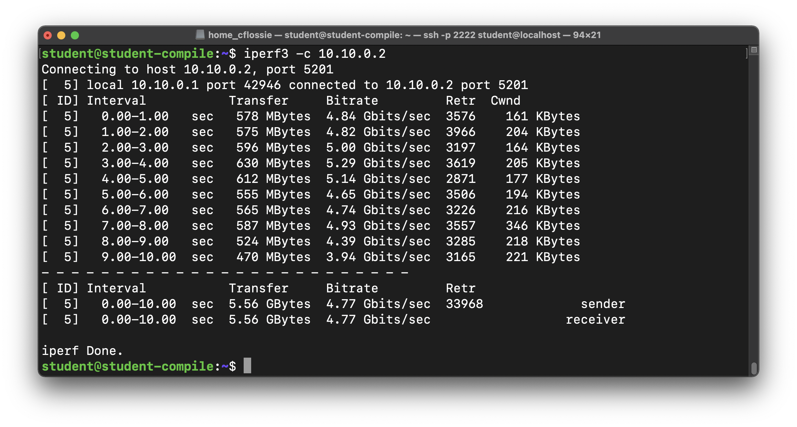
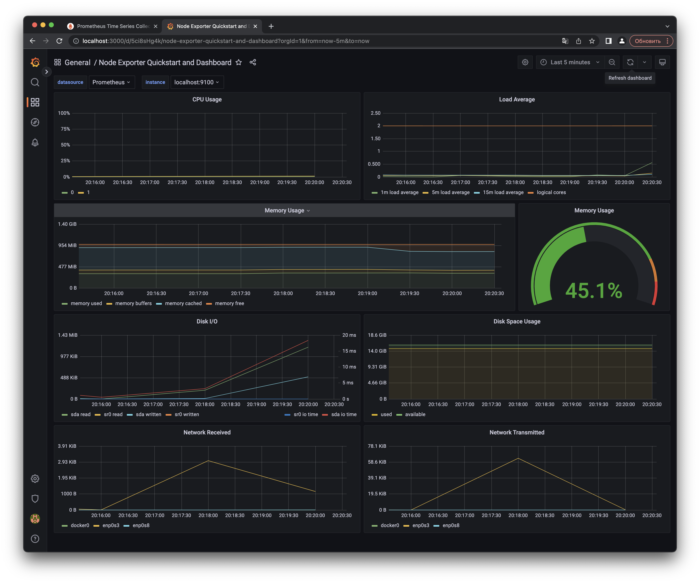

## Part 8. Готовый дашборд

Собственно, зачем составлять собственный дашборд, если, как говорится, "всё уже украдено до нас"?
Почему бы не взять готовый дашборд, на котором есть все нужные метрики?

**== Задание ==**

##### Установить готовый дашборд *Node Exporter Quickstart and Dashboard* с официального сайта **Grafana Labs**

##### Провести те же тесты, что и в [Части 7](#part-7-prometheus-и-grafana)

##### После команды `stress -c 2 -i 1 -m 1 --vm-bytes 32M -t 10s`

##### Запустить ещё одну виртуальную машину, находящуюся в одной сети с текущей
##### Запустить тест нагрузки сети с помощью утилиты **iperf3**

##### Посмотреть на нагрузку сетевого интерфейса

