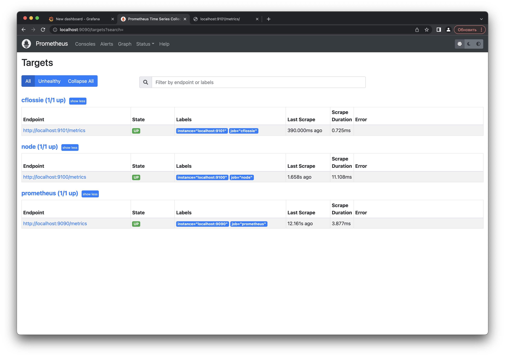
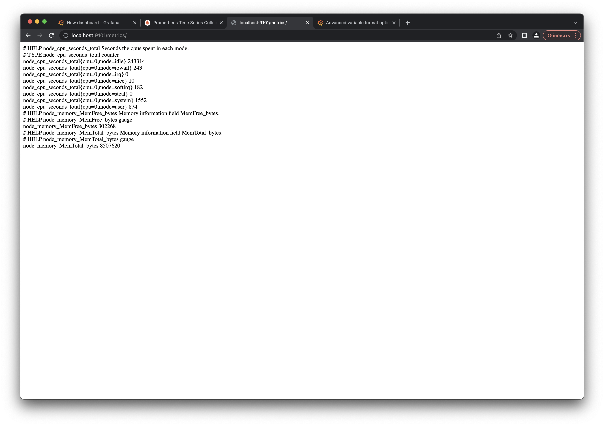
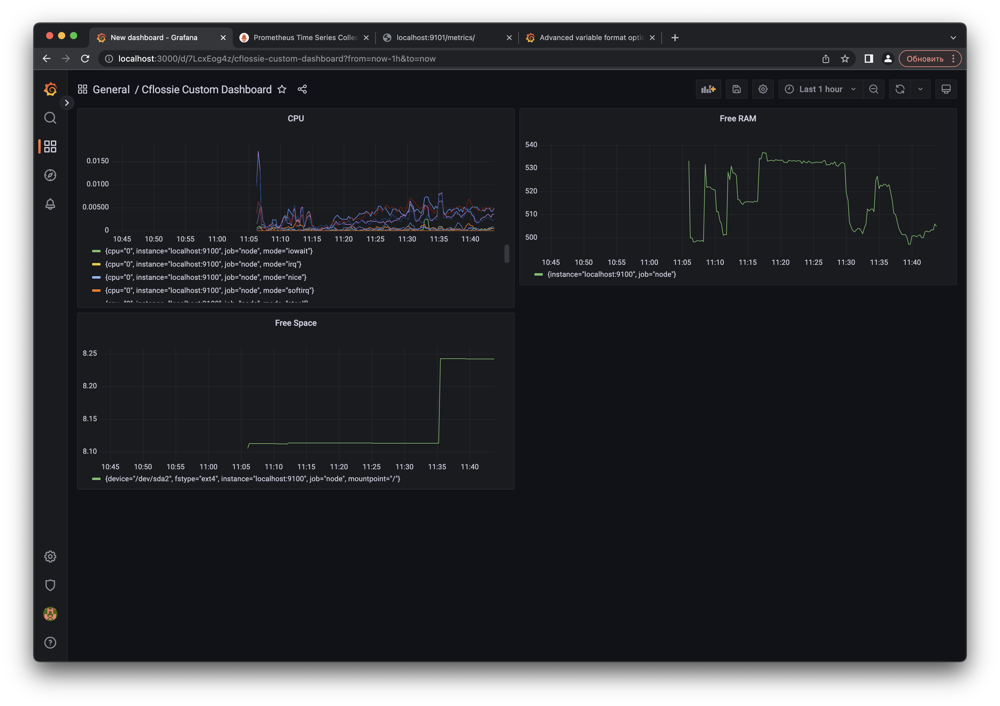
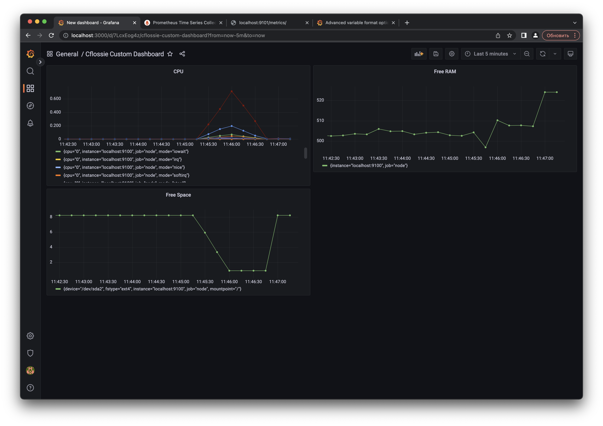
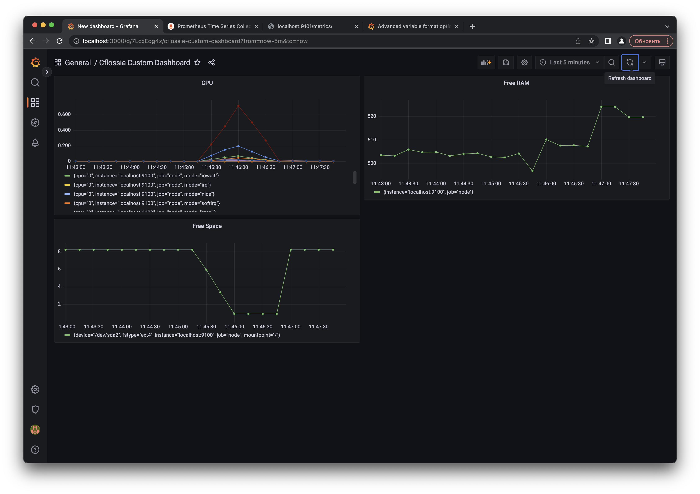

## Part 9. Дополнительно. Свой *node_exporter*

Анализировать систему с помощью специальных утилит полезно и удобно, но вам всегда хотелось понять, как же они работают.

**== Задание ==**

Написать bash-скрипт или программу на Си, которая собирает информацию по базовым метрикам системы (ЦПУ, оперативная память, жесткий диск (объем)).
Скрипт или программа должна формировать html страничку по формату **Prometheus**, которую будет отдавать **nginx**. \

Саму страничку обновлять можно как внутри bash-скрипта или программы (в цикле), так и при помощи утилиты cron, но не чаще, чем раз в 3 секунды.

##### Поменять конфигурационный файл **Prometheus**, чтобы он собирал информацию с созданной вами странички.

##### Провести те же тесты, что и в [Части 7](#part-7-prometheus-и-grafana)

##### Проводим отчистку после засорения файловой системы

##### Запустить команду stress -c 2 -i 1 -m 1 --vm-bytes 32M -t 10s

