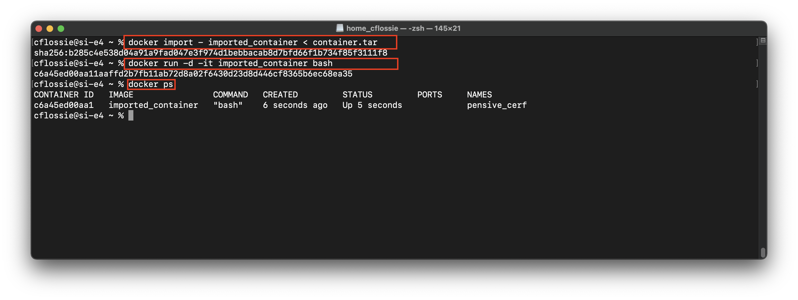

# Simple Docker by Corrin Flossie

## Part 1. Готовый докер

**== Задание ==**

##### Взять официальный докер образ с **nginx** и выкачать его при помощи `docker pull`
##### Проверить наличие докер образа через `docker images`

*
Рис. 1 Берем образ и проверяем его наличие
*

##### Запустить докер образ через `docker run -d [image_id|repository]`

*
Рис. 2 Запуск докер образа
*

##### Проверить, что образ запустился через `docker ps`

*
Рис. 3 Проверка запуска докер образа
*

##### Посмотреть информацию о контейнере через `docker inspect [container_id|container_name]`
##### По выводу команды определить и поместить в отчёт размер контейнера, список замапленных портов и ip контейнера

*
Рис. 4 Размер контейнера
*

*
Рис. 5 Список портов и IP
*

##### Остановить докер образ через `docker stop [container_id|container_name]`
##### Проверить, что образ остановился через `docker ps`

*
Рис. 6 Остановка и проверка
*

##### Запустить докер с замапленными портами 80 и 443 на локальную машину через команду *run*

*
Рис. 7 Запуск докера с замапленными портами
*

##### Проверить, что в браузере по адресу *localhost:80* доступна стартовая страница **nginx**

*
Рис. 8 Стартовая страница
*

##### Перезапустить докер образ через `docker restart [image_id|repository]`
##### Проверить любым способом, что контейнер запустился

*
Рис. 9 Перезапуск и проверка
*

## Part 2. Операции с контейнером

**== Задание ==**

##### Прочитать конфигурационный файл *nginx.conf* внутри докер образа через команду *exec*

*
Рис. 10 Конфиг nginx.conf
*

##### Создать на локальной машине файл *nginx.conf*
##### Настроить в нем по пути */status* отдачу страницы статуса сервера **nginx**

*
Рис. 11 Создаем свой nginx.conf
*

##### Скопировать созданный файл *nginx.conf* внутрь докер образа через команду `docker cp`
##### Перезапустить **nginx** внутри докер образа через команду *exec*

*
Рис. 12 Копируем конфиг и перезапускаем
*

##### Проверить, что по адресу *localhost:80/status* отдается страничка со статусом сервера **nginx**

*
Рис. 13 Статус сервера
*

##### Экспортировать контейнер в файл *container.tar* через команду *export*
##### Остановить контейнер

*
Рис. 14 Экспорт контейнера и остановка
*

##### Удалить образ через `docker rmi [image_id|repository]`, не удаляя перед этим контейнеры

*
Рис. 15 Удаление образа
*

##### Импортировать контейнер обратно через команду *import*
##### Запустить импортированный контейнер

*
Рис. 16 Импорт и запуск контейнера
*